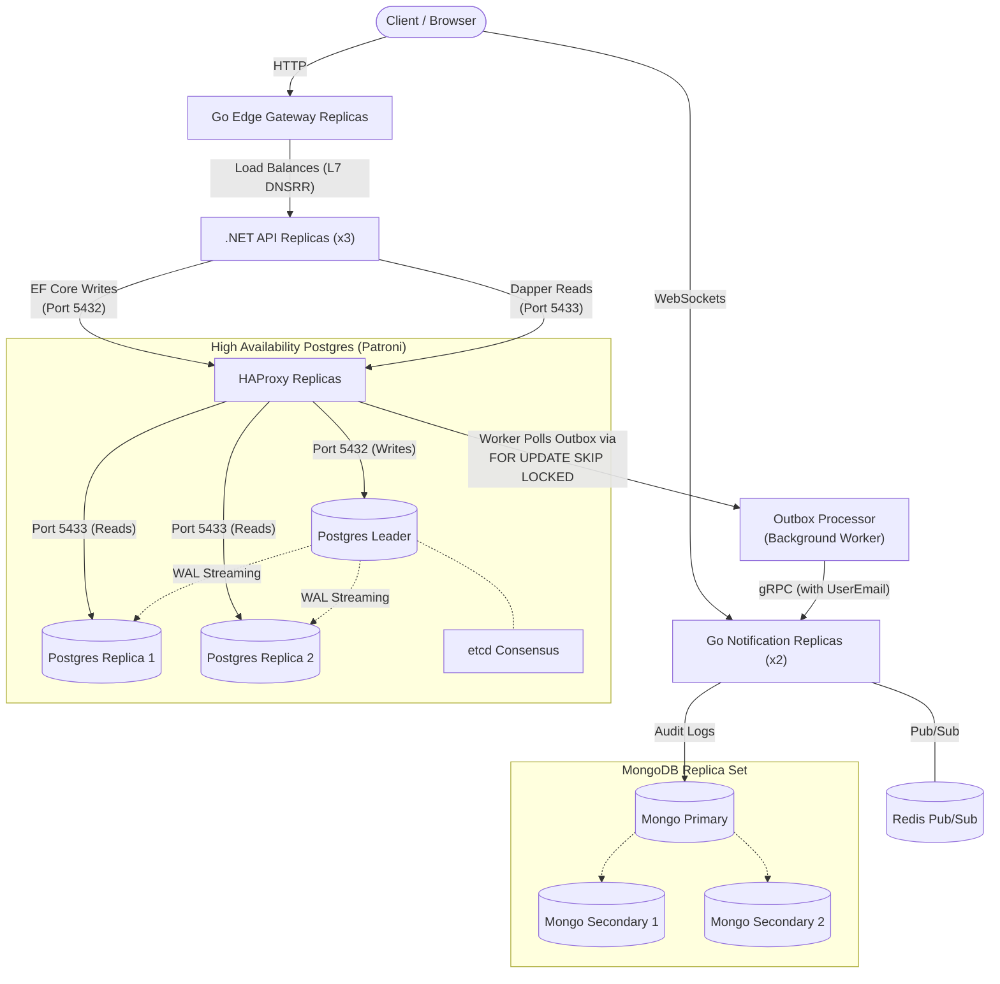

#  Issue Tracker Architecture

> # Project Status: Active Development

##  The Tech Stack

### 1. The Core API (C# .NET)

Handles the primary business logic and state mutations.

* **Framework:** .NET 10 (Clean Architecture with CQRS via MediatR).
* **CQRS Application Layer (EF Core + Dapper):**
* **Commands (Writes):** Operations like `CreateIssue`, `UpdateIssue`, and `DeleteIssue` use Entity Framework Core via the `DefaultConnection` on port `5432`, hitting the Primary node exclusively.
* **Queries (Reads):** Operations like `GetAllIssuesQuery` and `GetIssueByIdQuery` bypass EF Core Change Trackers completely. They inject an abstract `ISqlConnectionFactory` (registered as a memory-efficient Singleton) and execute via Dapper over the `ReadOnlyConnection` on port `5433`.
* **High-Performance Pagination:** Using Dapper's `.QueryMultipleAsync()`, handlers execute both `SELECT COUNT(*)` and `SELECT * ... LIMIT @PageSize OFFSET @Offset` in a single network trip.


* **Security:** JWT Authentication with stateless Access Tokens and HttpOnly, SameSite=Strict Refresh Cookies.
* **Transactional Outbox Pattern:** Every issue mutation atomically writes an `OutboxMessage` to the database in the same transaction as the domain change. A background worker (`OutboxProcessorService`) polls for unprocessed messages and dispatches them via gRPC to the Notification Service, guaranteeing **at-least-once delivery** with no lost events.
* **User Identity Tracking:** Each outbox message captures the authenticated user's email (`UserEmail`) from the JWT claims, creating a full audit trail of *who* performed *what* action.

### 2. The Edge Gateway (Go Reverse Proxy)

Manages ingress traffic and protects the internal network.

* **Language:** Go
* **Features:**
* **Rate Limiting:** Protects backend services from abuse.
* **Edge Authentication:** Validates JWT cryptographic signatures before traffic is allowed into the private subnet.
* **Custom DNS Round Robin (DNSRR):** Bypasses Docker Swarm's default Layer 4 Virtual IP (VIP). The `.NET API` explicitly uses `endpoint_mode: dnsrr`, allowing the Go Gateway to query the raw IP addresses of all running `.NET` containers and perform its own intelligent Layer 7 load-balancing. External traffic hitting the proxy itself is still safely routed via Swarm's default Ingress VIP.


### 3. The HA Database Stack (Patroni + HAProxy)

Ensures zero-downtime failover, consensus for PostgreSQL, and scalable read routing.

* **The Brain (etcd Raft Cluster):** A 3-node etcd consensus cluster (etcd1, etcd2, etcd3) uses the Raft consensus algorithm to ensure there is always mathematical agreement on who the database "Leader" is, completely preventing Split-Brain data corruption.
* **The Muscle (Patroni & PostgreSQL via Zalando Spilo):** Utilizing the `ghcr.io/zalando/spilo-17:4.0-p3` image, the three Patroni containers fight for the "Leader Lock" in etcd.
* **State Machine Replication:** The winner becomes the Primary (Read/Write). Losers automatically configure as Standby (Read-Only) replicas and stream the Write-Ahead Log (WAL).
* **Self-Healing:** If the Primary dies, its lock expires. The remaining nodes instantly hold an election to promote a new Primary.


* **The Router (HAProxy & Dual-Port Routing):** Acts as an invisible TCP pipe load balancing the database traffic.
* **Port 5432 (Write/Leader Traffic):** Sends HTTP pings to the Patroni REST API (`port 8008`) expecting `HTTP 200 OK` from `/`. Only the active Leader receives write traffic.
* **Port 5433 (Read-Only Replica Traffic):** A secondary listener using `option httpchk GET /replica` automatically load-balances read-only queries across all healthy Standby replica nodes.


### 4. The Real-Time Engine (Go Microservice)

Handles asynchronous auditing and live UI updates.

* **Language:** Go
* **Ingestion:** High-speed gRPC server that catches binary payloads from the .NET API's Outbox Processor.
* **Audit Logging:** Asynchronously writes immutable audit trails (including user identity) into a NoSQL MongoDB sink.
* **Pub/Sub Broker:** Broadcasts updates into dynamic Redis channels (e.g., `issue-{id}-updates`).
* **The Final Mile:** Houses a WebSocket server that uses Pattern Matching (`PSUBSCRIBE`) to route Redis messages to the exact browser DOMs that are actively watching a specific issue.

---

## 🗺️ Architecture Diagram (Docker Swarm Cluster)



---

## 📦 Transactional Outbox Pattern

The system uses the **Transactional Outbox Pattern** to guarantee reliable event delivery between the .NET API and the Go Notification Service.

### How It Works

1. **Atomic Write:** When a user creates, updates, or deletes an issue, `AppDbContext.SaveChangesAsync()` intercepts the change and writes an `OutboxMessage` to the same PostgreSQL transaction as the domain entity change. This guarantees that the event is never lost.
2. **Background Processing:** The `OutboxProcessorService` (a .NET `BackgroundService`) runs on every API replica, querying the database through the HAProxy layer every 3 seconds for unprocessed messages.
3. **Concurrency Control:** To prevent duplicate processing across the 3 API replicas, the outbox query uses PostgreSQL's row-level locking:
```sql
SELECT * FROM "OutboxMessages"
WHERE "ProcessedOnUtc" IS NULL
ORDER BY "OccurredOnUtc"
LIMIT 20
FOR UPDATE SKIP LOCKED

```


This ensures that when Replica A locks a message, Replicas B and C skip it entirely.
4. **gRPC Dispatch:** The worker deserializes the outbox payload, extracts the `IssueId`, `Action`, `UserEmail`, and `Timestamp`, then sends it via gRPC to the Go Notification Service.
5. **Mark as Processed:** Once the gRPC call succeeds, the message's `ProcessedOnUtc` is set and the transaction is committed.

---

## 🐋 Infrastructure & DevOps

This ecosystem is orchestrated using Docker Swarm.

* **Zero-Downtime Deployments:** The stack uses `update_config` for rolling restarts.
* **Scale-Out Capability:** Stateless services (.NET and Go) are explicitly replicated.
* **Automatic Migrations:** The .NET API automatically applies EF Core database migrations on startup (`db.Database.Migrate()`).
* **Security:** Environment variables and database credentials are fully abstracted away from the YAML blueprints.
* **Network Isolation:** All internal communication runs over encrypted Docker overlay networks. Only the Edge Proxy and WebSockets are exposed to the outside world.

## 🚀 Getting Started

1. Ensure you have initialized your node as a Docker Swarm manager (`docker swarm init`).
2. Copy `.env.example` to `.env` at the root and provide your local configuration variables.
3. Build and push your images to a registry (e.g., Docker Hub):
```bash
docker build -t <username>/issue-api .
docker build -t <username>/issue-proxy ./Proxy
docker build -t <username>/issue-notifications ./NotificationService

```


4. Deploy the architecture to the Swarm:
```bash
docker stack deploy -c docker-stack.yml issuetrackerswarm

```


*(Note: The .NET API will automatically apply EF Core database migrations on startup. Once deployed, access the API Gateway at `http://localhost:8081/swagger`)*