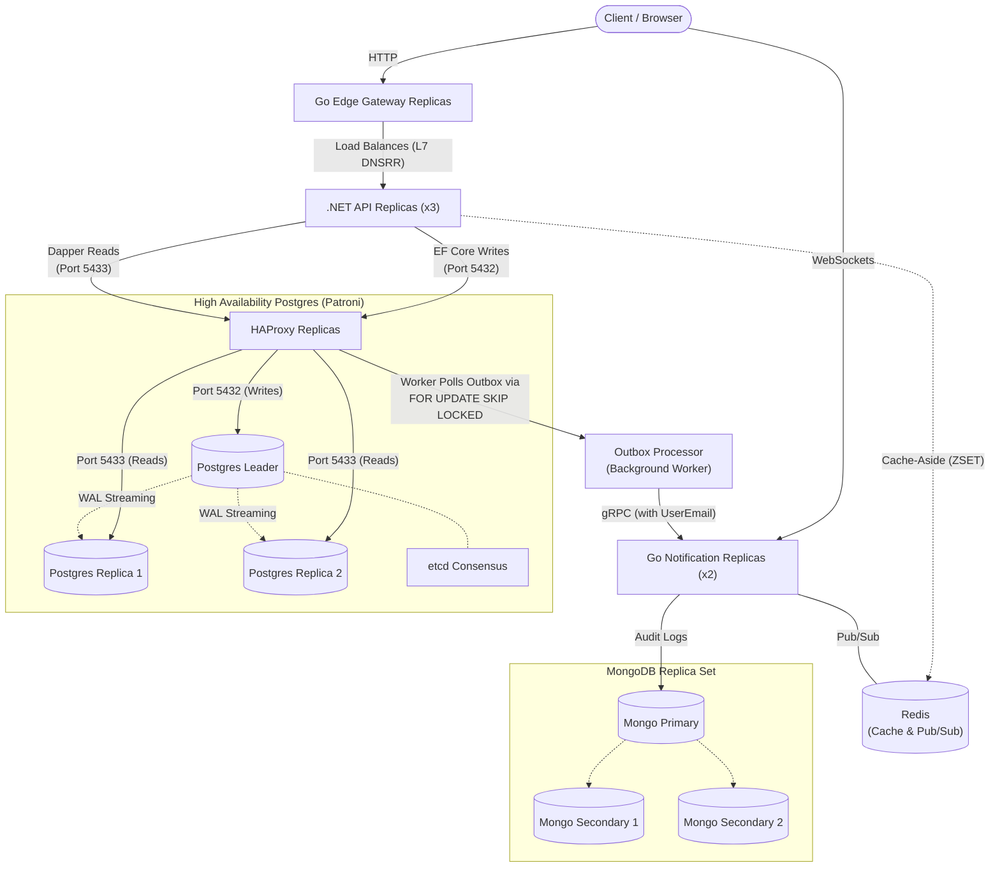
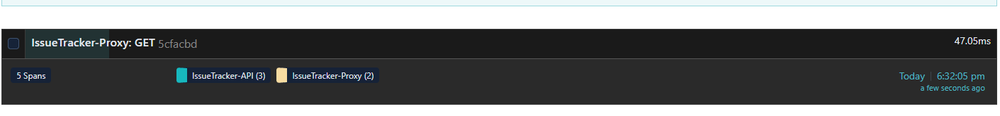
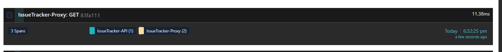

#  Issue Tracker Architecture


##  The Tech Stack

### 1. The Core API (C# .NET)

Handles the primary business logic and state mutations.

* **Framework:** .NET 10 (Clean Architecture with CQRS via MediatR).
* **CQRS Application Layer (EF Core + Dapper):**
* **Commands (Writes):** Operations like `CreateIssue`, `UpdateIssue`, and `DeleteIssue` use Entity Framework Core via the `DefaultConnection` on port `5432`, hitting the Primary node exclusively.
* **Queries (Reads):** Operations like `GetAllIssuesQuery` and `GetIssueByIdQuery` bypass EF Core Change Trackers completely. They inject an abstract `ISqlConnectionFactory` (registered as a memory-efficient Singleton) and execute via Dapper over the `ReadOnlyConnection` on port `5433`.
* **Redis Cursor Pagination:** A `ZSET` (Sorted Set) caching strategy using `StackExchange.Redis`. It acts as a Write-Through cache on Issue creation, pushing timeline feeds directly into memory to bypass the database entirely.
* **High-Performance Pagination:** Using Dapper's `.QueryMultipleAsync()`, handlers execute both `SELECT COUNT(*)` and `SELECT * ... LIMIT @PageSize OFFSET @Offset` in a single network trip.


* **Security:** JWT Authentication with stateless Access Tokens and HttpOnly, SameSite=Strict Refresh Cookies.
* **Transactional Outbox Pattern:** Every issue mutation atomically writes an `OutboxMessage` to the database in the same transaction as the domain change. A background worker (`OutboxProcessorService`) polls for unprocessed messages and dispatches them via gRPC to the Notification Service, guaranteeing **at-least-once delivery** with no lost events.
* **User Identity Tracking:** Each outbox message captures the authenticated user's email (`UserEmail`) from the JWT claims, creating a full audit trail of *who* performed *what* action.

### 2. The Edge Gateway (Go Reverse Proxy)

Manages ingress traffic and protects the internal network.

* **Language:** Go
* **Features:**
* **Rate Limiting:** Protects backend services from abuse.
* **Edge Authentication:** Validates JWT cryptographic signatures before traffic is allowed into the private subnet.
* **Custom DNS Round Robin (DNSRR):** Bypasses Docker Swarm's default Layer 4 Virtual IP (VIP). The `.NET API` explicitly uses `endpoint_mode: dnsrr`, allowing the Go Gateway to query the raw IP addresses of all running `.NET` containers and perform its own intelligent Layer 7 load-balancing. External traffic hitting the proxy itself is still safely routed via Swarm's default Ingress VIP.


### 3. The HA Database Stack (Patroni + HAProxy)

Ensures zero-downtime failover, consensus for PostgreSQL, and scalable read routing.

* **The Brain (etcd Raft Cluster):** A 3-node etcd consensus cluster (etcd1, etcd2, etcd3) uses the Raft consensus algorithm to ensure there is always mathematical agreement on who the database "Leader" is, completely preventing Split-Brain data corruption.
* **The Muscle (Patroni & PostgreSQL via Zalando Spilo):** Utilizing the `ghcr.io/zalando/spilo-17:4.0-p3` image, the three Patroni containers fight for the "Leader Lock" in etcd.
* **State Machine Replication:** The winner becomes the Primary (Read/Write). Losers automatically configure as Standby (Read-Only) replicas and stream the Write-Ahead Log (WAL).
* **Self-Healing:** If the Primary dies, its lock expires. The remaining nodes instantly hold an election to promote a new Primary.


* **The Router (HAProxy & Dual-Port Routing):** Acts as an invisible TCP pipe load balancing the database traffic.
* **Port 5432 (Write/Leader Traffic):** Sends HTTP pings to the Patroni REST API (`port 8008`) expecting `HTTP 200 OK` from `/`. Only the active Leader receives write traffic.
* **Port 5433 (Read-Only Replica Traffic):** A secondary listener using `option httpchk GET /replica` automatically load-balances read-only queries across all healthy Standby replica nodes.


### 4. The Real-Time Engine (Go Microservice)

Handles asynchronous auditing and live UI updates.

* **Language:** Go
* **Ingestion:** High-speed gRPC server that catches binary payloads from the .NET API's Outbox Processor.
* **Audit Logging:** Asynchronously writes immutable audit trails (including user identity) into a NoSQL MongoDB sink.
* **Pub/Sub Broker:** Broadcasts updates into dynamic Redis channels (e.g., `issue-{id}-updates`).
* **The Final Mile:** Houses a WebSocket server that uses Pattern Matching (`PSUBSCRIBE`) to route Redis messages to the exact browser DOMs that are actively watching a specific issue.

---

## Architecture Diagram (Docker Swarm Cluster)



---

## Transactional Outbox Pattern

The system uses the **Transactional Outbox Pattern** to guarantee reliable event delivery between the .NET API and the Go Notification Service.

### How It Works

1. **Atomic Write:** When a user creates, updates, or deletes an issue, `AppDbContext.SaveChangesAsync()` intercepts the change and writes an `OutboxMessage` to the same PostgreSQL transaction as the domain entity change. This guarantees that the event is never lost.
2. **Background Processing:** The `OutboxProcessorService` (a .NET `BackgroundService`) runs on every API replica, querying the database through the HAProxy layer every 3 seconds for unprocessed messages.
3. **Concurrency Control:** To prevent duplicate processing across the 3 API replicas, the outbox query uses PostgreSQL's row-level locking:
```sql
SELECT * FROM "OutboxMessages"
WHERE "ProcessedOnUtc" IS NULL
ORDER BY "OccurredOnUtc"
LIMIT 20
FOR UPDATE SKIP LOCKED

```


This ensures that when Replica A locks a message, Replicas B and C skip it entirely.
4. **gRPC Dispatch:** The worker deserializes the outbox payload, extracts the `IssueId`, `Action`, `UserEmail`, and `Timestamp`, then sends it via gRPC to the Go Notification Service.
5. **Mark as Processed:** Once the gRPC call succeeds, the message's `ProcessedOnUtc` is set and the transaction is committed.

---

## Full-Stack Distributed Tracing (OpenTelemetry & Jaeger)

The entire ecosystem is fully instrumented with **OpenTelemetry (OTel)**, providing end-to-end distributed tracing across language boundaries (.NET Core and Go) and visualizing the exact execution waterfalls in **Jaeger UI**.

### Key Observability Features:
1. **Cross-Language W3C Trace Context Propagation:** When the .NET API's background outbox worker dispatches an event over gRPC to the Go Notification Service, `.AddGrpcClientInstrumentation()` injects the W3C `traceparent` header into the gRPC metadata. In Go, `otelgrpc.NewServerHandler()` extracts the W3C baton, parenting the Go execution span directly under the .NET outbox span with zero orphaned traces.
2. **Directed Acyclic Graph (DAG) Heatmaps:** Traces are analyzed in Jaeger's Graph view using duration heatmaps to isolate the **Critical Path**.
3. **Total Time vs. Self Time Profiling:** 
   * **Total Time:** Captures parent waiting latency across network boundaries (e.g., Go Reverse Proxy waiting for .NET API responses).
   * **Self Time (Exclusive Time):** Isolates the exact CPU time consumed inside a specific microservice container, allowing instant identification of bottlenecks (e.g., distinguishing network serialization overhead from Entity Framework Core database execution).

---

## Performance Benchmarking (220,000+ Records)

To validate system performance under realistic production loads and avoid the **"Empty Table Illusion"**, the PostgreSQL master node (`patroni3`) was seeded with **220,021 issue records** (stream-replicated across all Standby nodes). 

### 1. The Cold Start vs. Steady-State Lifecycle
Across both `.NET Core` and `Go` containers in Docker Swarm, performance testing experimentally proved the difference between initial warmup tax and steady-state execution:
* **The Cold Start Tax (`~385 ms – 641 ms`):** The initial request to a newly deployed container absorbs the one-time `.NET RyuJIT Compiler` compilation cost, Entity Framework Core ORM model initialization, and PostgreSQL connection pool opening.
* **Steady-State Execution (`~11 ms – 28 ms`):** Once JIT-compiled instructions and database connection pools are hot in RAM, end-to-end write and read operations consistently execute in under 30 milliseconds across the overlay network.

### 2. Verified Benchmark Baselines (220k Scale)
* **B-Tree Primary Key Lookups (`GET /api/issue/{id}`):** Once B-Tree index pages are cached in PostgreSQL's RAM buffer pool, searching 220,000 records executes in **`17.68 ms`** ($\log_2(220,000) \approx 18$ tree operations).
* **Database Fallback (Cache Miss):** When the cache is empty (e.g., querying the first page), querying PostgreSQL directly establishes a baseline latency of **`~47 ms`**.
  
  

* **Redis Sorted Set (`ZSET`) Cursor Caching (Warm Cache):** When hitting the warmed Write-Through cache, the steady-state feed latency drops to **`~20 ms`**. This proves the speed of caching over database queries, achieving our targeted latency reduction and completely eliminating database execution spans from the critical path.

  

### 3. The "Thundering Herd" (100% Cache Miss Validation)
To validate the Cache-Aside architecture, the system was subjected to a load test generating completely random cursors, guaranteeing a **100% Cache Miss rate**:
* **The Result:** The system gracefully fell back to PostgreSQL, completing 100% of requests without crashing.
* **The Metrics:** Because every request executed heavy B-Tree index scans and attempted redundant writes back to Redis concurrently, the throughput dropped to **~101 Requests Per Second** at an average latency of **~968 ms**.
* **The Conclusion:** This perfectly validates the value of the Redis caching tier. The system operates roughly **40x faster** when serving traffic from memory compared to executing raw database lookups under heavy contention.

### 4. Distributed Locking & Cache Penetration (The Null Object Pattern)
To prevent the "Thundering Herd" bottleneck, a **Distributed Cache Stampede Lock** (`LockTakeAsync`) was implemented so that only one thread queries PostgreSQL per cursor. However, load testing revealed a critical edge case:
* **The Cache Penetration Trap:** When querying cursors that contained zero records, the empty result was never cached. The lock forced 100 concurrent connections to queue up sequentially, resulting in a catastrophic drop to **5 RPS** and **16.8 seconds** of latency.
* **The Solution (Negative Caching):** We implemented the Null Object Pattern. If the database returns 0 records, the cache service writes a temporary `Issues:Empty:{Cursor}` marker to Redis with a 30-second TTL.
* **The Final Benchmark:** With Negative Caching enabled, the test exploded to **1,390 Requests Per Second** at an average latency of **70ms** (with a minimum of **2ms** for cached empty hits), successfully proving the system is immune to both Thundering Herds and Cache Penetration attacks.

### 5. Edge Gateway Resilience (Load Testing)
To evaluate the limits of the Swarm network and the API, the gateway was load-tested using **Bombardier** (100 concurrent connections for 10 seconds).
* **The Traffic:** Generating sustained, aggressive traffic against the `GET /api/issue/feed` endpoint.
* **The Result:** The Go Edge Proxy successfully intercepted the traffic, engaged its rate limiter, and rejected the excess requests with `429 Too Many Requests`.
* **The Metrics:** During the test, the Gateway evaluated and blocked over **47,500 requests** while maintaining a throughput of **~4,773 Requests Per Second (RPS)** at an average latency of **~21 ms**, proving the internal backend services are heavily protected against Layer 7 DDoS attacks.

---

## Infrastructure & DevOps

This ecosystem is orchestrated using Docker Swarm.

* **Zero-Downtime Deployments:** The stack uses `update_config` for rolling restarts.
* **Scale-Out Capability:** Stateless services (.NET and Go) are explicitly replicated.
* **Automatic Migrations:** The .NET API automatically applies EF Core database migrations on startup (`db.Database.Migrate()`).
* **Security:** Environment variables and database credentials are fully abstracted away from the YAML blueprints.
* **Network Isolation:** All internal communication runs over encrypted Docker overlay networks. Only the Edge Proxy and WebSockets are exposed to the outside world.

### Architectural Decision: Single Node Redis
During High Availability testing, we discovered that Docker Swarm's ephemeral DNS handling (which returns `NXDOMAIN` during container task transitions) fundamentally breaks Redis Sentinel's consensus algorithm, causing it to enter `#tilt mode` rather than failing over. 

While migrating to **Redis Cluster** would solve this by bypassing Swarm DNS, Redis Cluster strictly requires a 6-node minimum architecture (3 Masters, 3 Replicas) which is a massive overkill for this application's current needs.

Therefore, we rely on Docker Swarm's native container auto-restarts to handle Redis node failures, and our C# `Soft SPOF Fallback` (try/catch blocks) to keep the API completely alive and functional while Swarm restarts the cache.

## Getting Started

1. Ensure you have initialized your node as a Docker Swarm manager (`docker swarm init`).
2. Copy `.env.example` to `.env` at the root and provide your local configuration variables.
3. Build and push your images to a registry (e.g., Docker Hub):
```bash
docker build -t <username>/issue-api .
docker build -t <username>/issue-proxy ./Proxy
docker build -t <username>/issue-notifications ./NotificationService

```


4. Deploy the architecture to the Swarm:
```bash
docker stack deploy -c docker-stack.yml issuetrackerswarm

```


*(Note: The .NET API will automatically apply EF Core database migrations on startup. Once deployed, access the API Gateway at `http://localhost:8081/swagger`)*